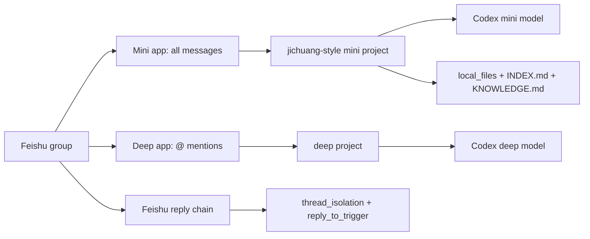

# codex-feishu

Dual-bot Feishu/Lark group routing for Codex through `cc-connect`.

[中文 README](README.zh-CN.md) · [中文安装教程](docs/install.zh-CN.md) · [Linux 中文安装](docs/install-linux.zh-CN.md)

`codex-feishu` turns a Feishu group into a practical Codex workspace:

- a fast mini bot monitors all group messages and decides whether to speak;
- the mini bot uses a configurable reply trigger threshold to avoid casual chatter;
- the mini bot can be configured to ignore deep bot mentions and their topic replies;
- a deep bot handles direct @ tasks with a stronger model;
- Feishu reply chains become isolated task sessions;
- `/help` and `/dream` provide static help and workspace maintenance without normal chat routing;
- deep @ tasks can send an immediate platform acknowledgement without a command hook;
- stream preview keeps long-running answers visible while Codex works;
- files can be saved, classified, indexed, and summarized into a local workspace.
- optional family-memory scripts can capture explicit `remember`, task, and shopping-list messages into workspace-local files.

This repository contains scripts and templates only. It does not contain app
secrets, user IDs, group IDs, or generated local config.

## Why This Exists

Most chat-bot setups choose between two bad defaults:

- listen only when mentioned, which misses files and useful group context;
- listen to every message, which wastes tokens and interrupts normal chat.

This project uses two Feishu apps to separate those jobs:

| Bot | Model | Trigger | Job |
|---|---|---|---|
| Mini bot | `gpt-5.4-mini` by default | all group messages, `strict` reply threshold | classify, stay silent, handle light work, organize files |
| Deep bot | `gpt-5.5` by default | @ mentions only | handle complex tasks directly |

## Architecture



## Features

- Dual Feishu app routing: one all-message monitor, one @-only deep bot.
- Optional `ignore_bot_mentions` route guard for patched `cc-connect` runtimes, so mini stays silent when a deep bot is @mentioned in a Feishu topic/reply chain.
- Configurable `gpt-5.4-mini` reply trigger threshold: `relaxed`, `medium`, or `strict`.
- Parallel task sessions through `thread_isolation = true`.
- Feishu reply continuation through `reply_to_trigger = true`.
- Hidden Windows background runner and watchdog scheduled tasks.
- Linux installer with systemd user service support.
- Optional Linux Codex API balance rotation from cc-switch providers that expose an OpenAI-compatible usage endpoint.
- Platform-layer immediate acknowledgement through patched `cc-connect` `instant_ack_text`.
- Optional family memory capture hook for workspace-local household memory, tasks, and shopping lists.
- Static `/help` command and `/dream` workspace maintenance command.
- Group project command hardening: `/shell`, `/dir`, `/cron`, `/provider`, `/restart`, `/upgrade`, and `/commands` are disabled.
- Stream preview tuned for visible progress during long replies.
- Workspace bootstrap with `AGENTS.md`, `INSTRUCTIONS.md`, `KNOWLEDGE.md`, `memory`, and `local_files`.
- File import helper with safe names, type classification, SHA256 short hash, and Markdown indexing.
- Feishu/Lark helper scripts for bounded event listening, resource download, and redacted health checks.
- GitHub-ready project metadata: CI, release configuration, issue templates, and release checklist.

## Requirements

- Windows 10/11 or Linux with bash/systemd
- PowerShell 5.1 or PowerShell 7 for Windows installs
- Node.js and npm
- `cc-connect` installed globally
- Two Feishu/Lark custom apps with bot capability

Install `cc-connect`:

```powershell
npm install -g cc-connect
cc-connect --version
```

## Feishu Apps

Create two Feishu custom apps:

1. Mini app
   - receives all group messages;
   - needs group all-message permission, usually shown as `im:message.group_msg`;
   - subscribes to `im.message.receive_v1`.

2. Deep app
   - receives @ messages only;
   - subscribes to `im.message.receive_v1`;
   - should not be granted all-message group receive unless you explicitly want it.

See [docs/feishu-console.md](docs/feishu-console.md) for the console checklist.

## Quick Start

Clone or copy this repository, then run on Windows:

```powershell
cd E:\codex-feishu
powershell.exe -NoProfile -ExecutionPolicy Bypass -File .\scripts\install.ps1
```

Run on Linux:

```bash
git clone https://github.com/GitLaughs/codex-feishu.git
cd codex-feishu
bash ./scripts/install-linux.sh
```

The installer asks for:

- Feishu group `chat_id`, for example `oc_xxx`
- mini app id and secret
- deep app id and secret
- group workspace path
- project names, model names, and reasoning effort
- mini reply trigger threshold
- `/dream` model and reasoning effort

The installer writes:

- `~\.cc-connect\config.toml`
- a local group workspace
- `AGENTS.md`, `INSTRUCTIONS.md`, `/help` guide, `/dream` prompt, memory folders, and file folders
- hidden scheduled tasks for cc-connect and the watchdog

## Non-Interactive Install

For repeatable local deployment:

```powershell
powershell.exe -NoProfile -ExecutionPolicy Bypass -File .\scripts\install.ps1 `
  -GroupChatId "oc_xxx" `
  -MiniProject "feishu-mini" `
  -DeepProject "feishu-deep" `
  -AdminOpenId "*" `
  -MiniModel "gpt-5.4-mini" `
  -MiniEffort "medium" `
  -MiniIgnoreBotMentions "feishu-deep,ou_deep_bot_open_id" `
  -MiniTriggerThreshold "strict" `
  -DeepModel "gpt-5.5" `
  -DeepEffort "high" `
  -DeepInstantAckText "收到正在输出，请等等我。" `
  -DreamModel "gpt-5.5" `
  -DreamEffort "xhigh" `
  -CodexMode "yolo" `
  -WorkspacePath "E:\FeishuCodexWorkspace" `
  -MiniAppId "cli_xxx" `
  -MiniAppSecret "..." `
  -DeepAppId "cli_yyy" `
  -DeepAppSecret "..." `
  -EnableFamilyMemory
```

Use `-NoScheduledTasks` if you only want to generate config and workspace files.

Optional Linux Codex API balance rotation:

```bash
bash ./scripts/install-linux.sh \
  --enable-codex-balance-rotate \
  --codex-rotate-db-path "$HOME/.cc-switch/cc-switch.db" \
  --codex-rotate-auth-path "$HOME/.codex/auth.json"
```

The rotation script checks configured cc-switch providers through `/v1/usage`, selects the highest positive remaining balance, and writes the selected key to Codex auth. It is provider-agnostic as long as the provider exposes the expected OpenAI-compatible usage response. Warmup uses the Responses API first and falls back to chat completions when the provider reports that Responses is unsupported. It does not retry a failed in-flight chat request; users can resend after the next key switch.

Linux non-interactive install:

```bash
bash ./scripts/install-linux.sh \
  --group-chat-id "oc_xxx" \
  --mini-project "feishu-mini" \
  --deep-project "feishu-deep" \
  --admin-open-id "*" \
  --mini-model "gpt-5.4-mini" \
  --mini-effort "medium" \
  --mini-ignore-bot-mentions "feishu-deep,ou_deep_bot_open_id" \
  --mini-trigger-threshold "strict" \
  --deep-model "gpt-5.5" \
  --deep-effort "high" \
  --deep-instant-ack-text "收到正在输出，请等等我。" \
  --dream-model "gpt-5.5" \
  --dream-effort "xhigh" \
  --codex-mode "yolo" \
  --workspace-path "$HOME/codex-feishu-workspace" \
  --mini-app-id "cli_xxx" \
  --mini-app-secret "..." \
  --deep-app-id "cli_yyy" \
  --deep-app-secret "..." \
  --enable-family-memory
```

Use `--no-systemd` if you only want to generate config and workspace files on Linux.

## Expected Chat Behavior

Normal group message:

1. mini bot receives it;
2. mini applies the configured trigger threshold;
3. if mini decides to handle it, the first visible reply is standalone `收到正在输出，请等等我。`;
4. casual chat stays silent and receives no acknowledgement.

Mini trigger threshold:

- `relaxed`: useful questions and project-relevant comments can trigger replies;
- `medium`: clear questions, tasks, files, or decision points trigger replies;
- `strict`: only explicit bot-directed work, actionable tasks, file handling, or important project context triggers replies.

Deep task:

1. user sends a root `@deep-bot ...` message;
2. the Feishu platform route sends immediate standalone `收到正在输出，请等等我。` when the runtime supports `instant_ack_text`;
3. deep model works directly, not through mini relay;
4. stream preview updates the Feishu message during long output.
5. long tasks should send a short progress update roughly once per minute.

When your `cc-connect` runtime supports `ignore_bot_mentions`, pass the deep bot
display name and/or open IDs to the mini installer option. This drops the root @
message and later replies in the same Feishu topic before `gpt-5.4-mini` runs.

Static commands:

- `/help`: returns `local_files/docs/help-guide.md` without model reasoning.
- `/dream`: runs a bounded workspace maintenance pass and writes detailed notes under `memory`.

Optional family memory:

- enable it with `-EnableFamilyMemory` on Windows or `--enable-family-memory` on Linux;
- the hook records only into the configured workspace under `memory/messages`, `memory/people`, and `memory/family`;
- supported explicit commands include `记住：...`, `忘掉：...`, `待办：...`, `购物：...`, and `你记得什么`;
- this hook is for memory capture only. It is not the immediate acknowledgement mechanism.

Parallel tasks:

- user A sends root @ question 1: session A;
- user B sends root @ question 2: session B;
- replying under question 1 continues session A;
- replying under question 2 continues session B.

## Verify

After installing and inviting both bots into the group:

```powershell
cc-connect sessions list
Get-Content .\cc-connect-run.log -Tail 80
```

Expected:

- normal group messages update the mini project;
- @ messages update the deep project;
- `/help` returns the generated static guide;
- `/dream` runs from the group workspace;
- only one `cc-connect.exe` process is running for the config;
- no Windows Terminal tabs appear when hooks run.

## Project Layout

```text
.
  docs/
    architecture.md
    feishu-console.md
    release-checklist.md
    troubleshooting.md
  scripts/
    install.ps1
    install-linux.sh
    start-cc-connect.ps1
    start-cc-connect.sh
    watch-cc-connect.ps1
    watch-cc-connect.sh
    cc-connect-ack.ps1
    cc-connect-ack.sh
    cc-connect-memory-hook.ps1
    cc-connect-memory-hook.sh
    family-memory-capture.ps1
    family-memory-capture.py
    help.ps1
    help.sh
    dream.ps1
    dream.sh
    import-local-file.ps1
    import-local-file.sh
    lark-download-resource.ps1
    lark-event-listener.ps1
    lark-health.ps1
    lark-download-resource.sh
    lark-event-listener.sh
    lark-health.sh
    test.ps1
    test-linux.sh
  templates/
    config.double-bot.toml
    config.double-bot.linux.toml
    AGENTS.md
    INSTRUCTIONS.md
    dream_prompt.md
    help-guide.md
  .github/
    workflows/ci.yml
    release.yml
```

## Documentation

- [Architecture](docs/architecture.md)
- [中文 README](README.zh-CN.md)
- [中文安装教程](docs/install.zh-CN.md)
- [Linux 中文安装教程](docs/install-linux.zh-CN.md)
- [Feishu console setup](docs/feishu-console.md)
- [Troubleshooting](docs/troubleshooting.md)
- [Release checklist](docs/release-checklist.md)
- [Third-party notices](THIRD_PARTY_NOTICES.md)
- [Contributing](CONTRIBUTING.md)
- [Security policy](SECURITY.md)
- [Changelog](CHANGELOG.md)

## Security

Never commit generated `config.toml`, app secrets, user IDs, or group IDs.

The installer writes secrets only to the local cc-connect config path. The
repository `.gitignore` excludes generated local config, logs, VBS wrappers, and
workspace files.

## Status

Preview. The scripts are intended for Windows local deployments and are designed
to be easy to inspect before running.

## Acknowledgements

This project is built as a deployment layer around
[cc-connect](https://github.com/chenhg5/cc-connect), an MIT-licensed open-source
bridge for connecting local AI coding agents to messaging platforms. `cc-connect`
provides the core Feishu/Lark integration, hooks, stream preview, session
management, and platform bridge that this repository configures.

See [THIRD_PARTY_NOTICES.md](THIRD_PARTY_NOTICES.md) and [NOTICE](NOTICE) for
license boundaries and attribution.

## License

MIT. See [LICENSE](LICENSE).
