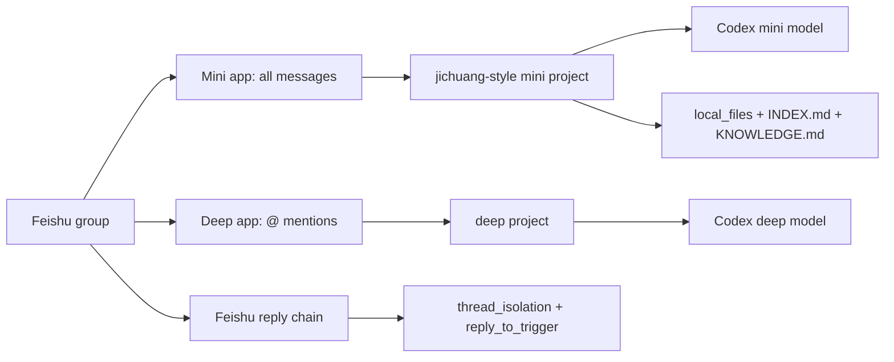

# codex-feishu

Dual-bot Feishu/Lark group routing for Codex through `cc-connect`.

`codex-feishu` turns a Feishu group into a practical Codex workspace:

- a fast mini bot monitors all group messages and decides whether to speak;
- a deep bot handles direct @ tasks with a stronger model;
- Feishu reply chains become isolated task sessions;
- immediate `received` acknowledgements run silently in the background;
- stream preview keeps long-running answers visible while Codex works;
- files can be saved, classified, indexed, and summarized into a local workspace.

This repository contains scripts and templates only. It does not contain app
secrets, user IDs, group IDs, or generated local config.

## Why This Exists

Most chat-bot setups choose between two bad defaults:

- listen only when mentioned, which misses files and useful group context;
- listen to every message, which wastes tokens and interrupts normal chat.

This project uses two Feishu apps to separate those jobs:

| Bot | Model | Trigger | Job |
|---|---|---|---|
| Mini bot | `gpt-5.4-mini` by default | all group messages | classify, stay silent, handle light work, organize files |
| Deep bot | `gpt-5.5` by default | @ mentions only | handle complex tasks directly |

## Architecture



## Features

- Dual Feishu app routing: one all-message monitor, one @-only deep bot.
- Parallel task sessions through `thread_isolation = true`.
- Feishu reply continuation through `reply_to_trigger = true`.
- Hidden Windows background runner and watchdog scheduled tasks.
- Hidden acknowledgement hook using `wscript.exe`.
- Stream preview tuned for visible progress during long replies.
- Workspace bootstrap with `INSTRUCTIONS.md`, `KNOWLEDGE.md`, and `local_files`.
- File import helper with safe names, type classification, SHA256 short hash, and Markdown indexing.
- GitHub-ready project metadata: CI, release configuration, issue templates, and release checklist.

## Requirements

- Windows 10 or Windows 11
- PowerShell 5.1 or PowerShell 7
- Node.js and npm
- `cc-connect` installed globally
- Two Feishu/Lark custom apps with bot capability

Install `cc-connect`:

```powershell
npm install -g cc-connect
cc-connect --version
```

## Feishu Apps

Create two Feishu custom apps:

1. Mini app
   - receives all group messages;
   - needs group all-message permission, usually shown as `im:message.group_msg`;
   - subscribes to `im.message.receive_v1`.

2. Deep app
   - receives @ messages only;
   - subscribes to `im.message.receive_v1`;
   - should not be granted all-message group receive unless you explicitly want it.

See [docs/feishu-console.md](docs/feishu-console.md) for the console checklist.

## Quick Start

Clone or copy this repository, then run:

```powershell
cd E:\codex-feishu
powershell.exe -NoProfile -ExecutionPolicy Bypass -File .\scripts\install.ps1
```

The installer asks for:

- Feishu group `chat_id`, for example `oc_xxx`
- mini app id and secret
- deep app id and secret
- group workspace path
- project names, model names, and reasoning effort

The installer writes:

- `~\.cc-connect\config.toml`
- a local group workspace
- hidden acknowledgement VBS wrapper
- hidden scheduled tasks for cc-connect and the watchdog

## Non-Interactive Install

For repeatable local deployment:

```powershell
powershell.exe -NoProfile -ExecutionPolicy Bypass -File .\scripts\install.ps1 `
  -GroupChatId "oc_xxx" `
  -MiniProject "feishu-mini" `
  -DeepProject "feishu-deep" `
  -AdminOpenId "*" `
  -MiniModel "gpt-5.4-mini" `
  -MiniEffort "medium" `
  -DeepModel "gpt-5.5" `
  -DeepEffort "high" `
  -CodexMode "yolo" `
  -WorkspacePath "E:\FeishuCodexWorkspace" `
  -MiniAppId "cli_xxx" `
  -MiniAppSecret "..." `
  -DeepAppId "cli_yyy" `
  -DeepAppSecret "..."
```

Use `-NoScheduledTasks` if you only want to generate config and workspace files.

## Expected Chat Behavior

Normal group message:

1. mini bot receives it;
2. acknowledgement hook can send standalone `收到`;
3. mini decides whether to reply;
4. casual chat stays silent.

Deep task:

1. user sends a root `@deep-bot ...` message;
2. deep bot sends/benefits from immediate `收到`;
3. deep model works directly, not through mini relay;
4. stream preview updates the Feishu message during long output.

Parallel tasks:

- user A sends root @ question 1: session A;
- user B sends root @ question 2: session B;
- replying under question 1 continues session A;
- replying under question 2 continues session B.

## Verify

After installing and inviting both bots into the group:

```powershell
cc-connect sessions list
Get-Content .\cc-connect-run.log -Tail 80
```

Expected:

- normal group messages update the mini project;
- @ messages update the deep project;
- only one `cc-connect.exe` process is running for the config;
- no Windows Terminal tabs appear when hooks run.

## Project Layout

```text
.
  docs/
    architecture.md
    feishu-console.md
    release-checklist.md
    troubleshooting.md
  scripts/
    install.ps1
    start-cc-connect.ps1
    watch-cc-connect.ps1
    cc-connect-ack.ps1
    import-local-file.ps1
    test.ps1
  templates/
    config.double-bot.toml
    INSTRUCTIONS.md
  .github/
    workflows/ci.yml
    release.yml
```

## Documentation

- [Architecture](docs/architecture.md)
- [Feishu console setup](docs/feishu-console.md)
- [Troubleshooting](docs/troubleshooting.md)
- [Release checklist](docs/release-checklist.md)
- [Third-party notices](THIRD_PARTY_NOTICES.md)
- [Contributing](CONTRIBUTING.md)
- [Security policy](SECURITY.md)
- [Changelog](CHANGELOG.md)

## Security

Never commit generated `config.toml`, app secrets, user IDs, or group IDs.

The installer writes secrets only to the local cc-connect config path. The
repository `.gitignore` excludes generated local config, logs, VBS wrappers, and
workspace files.

## Status

Preview. The scripts are intended for Windows local deployments and are designed
to be easy to inspect before running.

## Acknowledgements

This project is built as a deployment layer around
[cc-connect](https://github.com/chenhg5/cc-connect), an MIT-licensed open-source
bridge for connecting local AI coding agents to messaging platforms. `cc-connect`
provides the core Feishu/Lark integration, hooks, stream preview, session
management, and platform bridge that this repository configures.

See [THIRD_PARTY_NOTICES.md](THIRD_PARTY_NOTICES.md) and [NOTICE](NOTICE) for
license boundaries and attribution.

## License

MIT. See [LICENSE](LICENSE).
