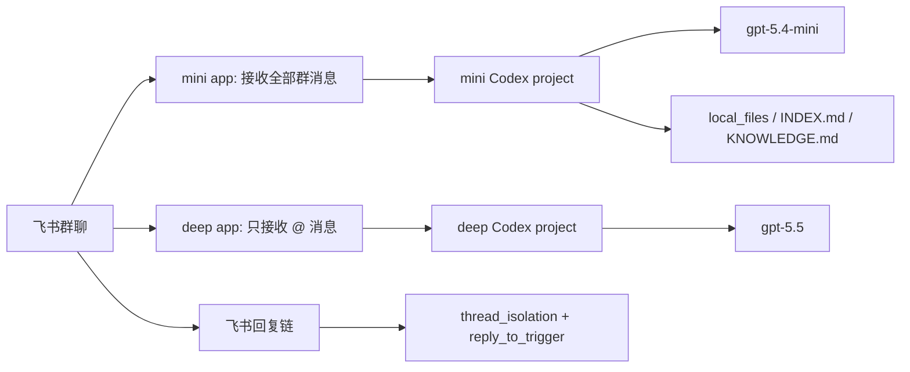

# codex-feishu

> 用两个飞书/Lark 机器人把 Codex 接入群聊：mini 机器人全量监听并判断是否回复，deep 机器人只处理 @ 触发的复杂任务。

[English README](README.md) · [Windows 安装](docs/install.zh-CN.md) · [Linux 安装](docs/install-linux.zh-CN.md) · [故障排查](docs/troubleshooting.md) · [MIT License](LICENSE)

关键词：飞书机器人、Lark 机器人、飞书群聊 Codex、Codex 群机器人、双机器人路由、话题隔离、即时收到回复、家庭记忆、群聊记忆、cc-connect 部署。

`codex-feishu` 适合想把本地 Codex 接到飞书群里的个人或小团队。它不是新的聊天机器人框架，而是一套围绕
[`cc-connect`](https://github.com/chenhg5/cc-connect) 的部署脚本、配置模板和使用约定。

最短安装方式：

```powershell
npm install -g cc-connect
git clone https://github.com/GitLaughs/codex-feishu.git
cd codex-feishu
powershell.exe -NoProfile -ExecutionPolicy Bypass -File .\scripts\install.ps1
```

## 解决什么问题

普通群聊机器人通常会卡在两个选择里：

- 只在 @ 时触发：省 token，但收不到普通消息、文件和有用上下文。
- 所有消息都触发：能处理文件和上下文，但闲聊也会消耗模型调用。

这个项目用两个飞书应用拆开职责：

| 机器人 | 默认模型 | 触发方式 | 主要职责 |
|---|---|---|---|
| mini bot | `gpt-5.4-mini` | 群聊全量消息，默认 `strict` 回复阈值 | 监听、判断是否回复、处理轻量问题、整理文件 |
| deep bot | `gpt-5.5` | 只处理 @ 消息 | 直接处理复杂任务，不经过 mini 转发 |

## 核心能力

- 双飞书应用路由：mini 全量监听，deep 只处理 @。
- 可选 `ignore_bot_mentions` 路由保护：deep bot 被 @ 及其话题回复时，mini 静默不抢活。
- `gpt-5.4-mini` 回复阈值：`relaxed`、`medium`、`strict`。
- 飞书回复链隔离会话：不同人的不同任务可以并行处理。
- @ 任务直接进入 deep bot，避免 mini 中转带来的误路由。
- 支持流式预览，让长任务不再像“卡住了”。
- `/help` 静态帮助和 `/dream` 工作区整理命令。
- 确定性只读命令：`/files`、`/memfind`、`/knowledge`、`/tasks`、`/workspace-info`、`/status-index`、`/health-codex-feishu`。
- Windows 后台静默启动，不弹出终端窗口。
- Linux 支持 `install-linux.sh` 和 systemd user service。
- 新手 Ubuntu bootstrap 脚本可自动准备 apt 依赖、swap、Node.js 22、Codex、cc-connect，并 clone/update 仓库。
- Linux 可选安装 Codex API 余额轮询：从 cc-switch 中兼容 OpenAI API 的 provider 里按余额选择可用 key，写入 Codex auth，默认每 30 分钟检查一次。
- 机器人决定处理消息时先给原消息加 `OnIt` / workingonit 表情 reaction；mini 静默时不加额外回复。
- 支持平台层画图命令：`/画图`、`/生图`、`/img`、`画图`、`生图`。
- 可选家庭记忆捕获：把明确的“记住 / 待办 / 购物 / 查记忆”消息写到工作区本地 `memory` 文件。
- 本地文件整理约定：`local_files`、`INDEX.md`、`KNOWLEDGE.md`。
- `workspace_manifest.json` 记录当前群工作区入口、命令面、数据源和 planned commands。
- 群聊项目默认禁用 `/shell`、`/dir`、`/cron`、`/provider`、`/restart`、`/upgrade`、`/commands`。

## 工作方式



典型行为：

- 普通群消息先进入 mini bot，mini 根据阈值判断是否回复。
- 闲聊、简单附和、和项目无关的消息默认静默。
- 文件、明确任务、项目相关问题会被处理。
- 用户 @ deep bot 时，任务直接进入 deep bot。
- 如果底层 `cc-connect` 支持 `ignore_bot_mentions`，mini 会在进入模型前丢弃 deep bot 的 @ 根消息和同话题后续回复。
- 用户用飞书“回复”继续某条任务时，会回到对应会话。
- `/help` 直接返回静态指南，不进入模型推理。
- `/dream` 使用 deep 模型整理本地工作区知识、索引和记忆。
- `/files`、`/memfind`、`/knowledge`、`/tasks` 走 SQLite/FTS5 本地索引，不进入模型推理。

## 安装前准备

需要：

- Windows 10/11，或带 bash/systemd 的 Linux
- Windows 安装需要 PowerShell 5.1 或 PowerShell 7
- Node.js 和 npm
- `cc-connect`
- 两个飞书/Lark 自建应用，并开启机器人能力

安装 `cc-connect`：

```powershell
npm install -g cc-connect
cc-connect --version
```

飞书侧需要两个应用：

- mini app：导入 `templates/feishu-mini-scopes.json`，申请群聊全量消息权限，订阅 `im.message.receive_v1`。
- deep app：导入 `templates/feishu-deep-scopes.json`，只用于 @ 触发，不建议开启群聊全量消息权限。

权限变更后必须在飞书开放平台创建并发布新版本。控制台入口格式：

```text
https://open.feishu.cn/app/<app_id>
```

Windows 完整步骤见 [中文安装教程](docs/install.zh-CN.md)。
Linux 完整步骤见 [Linux 安装教程](docs/install-linux.zh-CN.md)。

全新 Ubuntu 服务器可以先跑：

```bash
sudo bash ./scripts/bootstrap-linux.sh --checkout-dir /opt/codex-feishu
cd /opt/codex-feishu
bash ./scripts/install-linux.sh
```

## 快速安装

Windows 交互式安装：

```powershell
cd E:\codex-feishu
powershell.exe -NoProfile -ExecutionPolicy Bypass -File .\scripts\install.ps1
```

Linux 交互式安装：

```bash
git clone https://github.com/GitLaughs/codex-feishu.git
cd codex-feishu
bash ./scripts/install-linux.sh
```

安装器会询问：

- 飞书群 `chat_id`，例如 `oc_xxx`
- mini app id 和 secret
- deep app id 和 secret
- 本地群聊工作区路径
- 项目名、模型名、推理强度
- mini 回复触发阈值
- `/dream` 使用的模型和推理强度

安装器会写入：

- `~\.cc-connect\config.toml`
- 本地群聊工作区
- `AGENTS.md`、`INSTRUCTIONS.md`、`help-guide.md`、`dream_prompt.md`
- Windows 计划任务和 watchdog

## 非交互安装

适合重复部署或记录团队配置：

```powershell
powershell.exe -NoProfile -ExecutionPolicy Bypass -File .\scripts\install.ps1 `
  -GroupChatId "oc_xxx" `
  -MiniProject "feishu-mini" `
  -DeepProject "feishu-deep" `
  -AdminOpenId "*" `
  -MiniModel "gpt-5.4-mini" `
  -MiniEffort "medium" `
  -MiniIgnoreBotMentions "feishu-deep,ou_deep_bot_open_id" `
  -MiniTriggerThreshold "strict" `
  -DeepModel "gpt-5.5" `
  -DeepEffort "high" `
  -DreamModel "gpt-5.5" `
  -DreamEffort "xhigh" `
  -CodexMode "yolo" `
  -WorkspacePath "E:\FeishuCodexWorkspace" `
  -MiniAppId "cli_xxx" `
  -MiniAppSecret "..." `
  -DeepAppId "cli_yyy" `
  -DeepAppSecret "..."
```

只生成配置和工作区，不注册计划任务：

```powershell
powershell.exe -NoProfile -ExecutionPolicy Bypass -File .\scripts\install.ps1 -NoScheduledTasks
```

Linux 非交互安装：

```bash
bash ./scripts/install-linux.sh \
  --group-chat-id "oc_xxx" \
  --mini-project "feishu-mini" \
  --deep-project "feishu-deep" \
  --admin-open-id "*" \
  --mini-model "gpt-5.4-mini" \
  --mini-effort "medium" \
  --mini-ignore-bot-mentions "feishu-deep,ou_deep_bot_open_id" \
  --mini-trigger-threshold "strict" \
  --deep-model "gpt-5.5" \
  --deep-effort "high" \
  --dream-model "gpt-5.5" \
  --dream-effort "xhigh" \
  --codex-mode "yolo" \
  --workspace-path "$HOME/codex-feishu-workspace" \
  --mini-app-id "cli_xxx" \
  --mini-app-secret "..." \
  --deep-app-id "cli_yyy" \
  --deep-app-secret "..."
```

Linux 只生成配置、不注册 systemd：

```bash
bash ./scripts/install-linux.sh --no-systemd
```

Linux 可选开启 Codex API 余额轮询：

```bash
bash ./scripts/install-linux.sh \
  --enable-codex-balance-rotate \
  --codex-rotate-db-path "$HOME/.cc-switch/cc-switch.db" \
  --codex-rotate-auth-path "$HOME/.codex/auth.json"
```

轮询脚本只负责选择当前余额最高且 `/v1/usage` 可用的 cc-switch provider，并写入 Codex auth。provider 不固定为某个服务名，只要兼容预期的 OpenAI API usage 返回即可。warmup 默认先试 Responses API；如果 provider 明确不支持 Responses，会自动改用 chat completions warmup。它不做单条消息失败后的自动重试；如果一次回答撞上余额或服务错误，用户重新发送即可使用下一次轮询/切换后的 key。

## 画图命令

当运行时支持 `image_command_enabled` 时，安装器生成的 Feishu 配置会启用 `/画图`、`/生图`、`/img`、`画图`、`生图`。平台层会直接调用 `scripts/generate-image.js`，上传图片，并把图片保存到 `local_files/generated/images/`，元数据写入 `memory/image-events-YYYY-MM-DD.jsonl`。

服务环境需要提供兼容 OpenAI Images API 的图像 key，例如：

```bash
FEISHU_IMAGE_BASE_URL=https://api.openai.com/v1
FEISHU_IMAGE_API_KEY=sk-...
FEISHU_IMAGE_API_MODE=images
FEISHU_IMAGE_IMAGES_MODEL=gpt-image-1
```

## 只读检索和健康检查

安装器会把确定性命令脚本复制到群工作区，并在 `config.toml` 中注册：

- `/files find <关键词>`：搜索本群文件、知识库、manifest。
- `/files recent [数量]`：查看最近本地文件。
- `/files pending`：查看未分类 `local_files/incoming` 文件。
- `/knowledge summary`：查看 `KNOWLEDGE.md` 摘要。
- `/knowledge search <关键词>`：只查 curated knowledge。
- `/memfind <关键词>` 和 `/memfind recent [数量]`：查记忆和项目记录。
- `/tasks list`：查看任务条目。
- `/workspace-info`：查看工作区 manifest 和命令面。
- `/status-index`：查看 SQLite/FTS5 索引状态。
- `/health-codex-feishu`：检查 manifest、help、文件索引、记忆和 runs 脱敏状态。

索引可按需刷新：

```powershell
powershell.exe -NoProfile -ExecutionPolicy Bypass -File .\scripts\codex-feishu-reindex.ps1 -Root E:\FeishuCodexWorkspace -Force
```

写记忆相关命令目前只进入 `planned_commands`，不会作为 active command 上线，直到确认、审计和软删除链路完成。路线图见 [docs/memory-file-optimization-plan.md](docs/memory-file-optimization-plan.md)。

## 可选家庭记忆

如果这个群是家庭群或需要长期轻量记忆，可以在安装时开启：

```powershell
powershell.exe -NoProfile -ExecutionPolicy Bypass -File .\scripts\install.ps1 `
  -EnableFamilyMemory
```

Linux 对应参数：

```bash
bash ./scripts/install-linux.sh --enable-family-memory
```

开启后安装器会复制 `family-memory-capture.*` 和 `cc-connect-memory-hook.*`，并创建：

```text
memory/messages
memory/people
memory/family
memory/summaries
```

这个 hook 只做本地记忆捕获，不负责“收到”即时回复。deep 的即时回复由 `instant_ack_text` 平台字段处理。支持的显式消息包括：

- `记住：妈妈不太吃辣`
- `忘掉：某条旧记忆`
- `待办：周末检查空调滤网`
- `购物：牛奶、鸡蛋`
- `你记得什么`

## mini 回复阈值

`-MiniTriggerThreshold` 控制 mini bot 对普通群消息的保守程度：

- `relaxed`：可能有用的问题、轻量请求、项目相关评论都可以回复。
- `medium`：只回复清晰问题、任务、文件事件或项目决策点。
- `strict`：默认值。只有明确叫机器人、明确分配任务、需要处理文件，或不处理会丢失重要项目上下文时才回复。

注意：这个阈值写入生成的 `INSTRUCTIONS.md`，由 Codex 项目按规则执行；它不是 `cc-connect` 的底层协议字段。

## deep @ 路由保护

如果你的 `cc-connect` 运行时支持 `ignore_bot_mentions`，建议把 deep bot 的显示名和 open_id 写进 mini 配置：

```powershell
-MiniIgnoreBotMentions "feishu-deep,ou_deep_bot_open_id"
```

Linux 对应参数：

```bash
--mini-ignore-bot-mentions "feishu-deep,ou_deep_bot_open_id"
```

安装器会在 mini 的 Feishu platform options 中生成：

```toml
ignore_bot_mentions = ["feishu-deep", "ou_deep_bot_open_id"]
```

这会让 mini 在全量监听模式下跳过 deep bot 的 @ 根消息，并记住对应飞书话题/回复链，后续同话题回复也不再进入 `gpt-5.4-mini`。

## 验证

安装并把两个机器人拉进群后执行：

```powershell
cc-connect sessions list
Get-Content .\cc-connect-run.log -Tail 80
```

预期结果：

- 普通群消息能进入 mini project。
- @ deep bot 的消息进入 deep project。
- 飞书回复某条任务消息时，会继续对应会话。
- `/help` 返回生成的静态指南。
- `/dream` 在群聊工作区内执行整理。
- hook 和后台任务不会弹出 Windows Terminal。

## 项目结构

```text
.
  docs/
    install.zh-CN.md
    architecture.md
    feishu-console.md
    troubleshooting.md
  scripts/
    install.ps1
    install-linux.sh
    start-cc-connect.ps1
    watch-cc-connect.ps1
    cc-connect-ack.ps1
    cc-connect-ack.sh
    cc-connect-memory-hook.ps1
    cc-connect-memory-hook.sh
    family-memory-capture.ps1
    family-memory-capture.py
    help.ps1
    dream.ps1
    import-local-file.ps1
    import-local-file.sh
    lark-download-resource.ps1
    lark-event-listener.ps1
    lark-health.ps1
    lark-download-resource.sh
    lark-event-listener.sh
    lark-health.sh
    test.ps1
  templates/
    config.double-bot.toml
    config.double-bot.linux.toml
    AGENTS.md
    INSTRUCTIONS.md
    dream_prompt.md
    help-guide.md
```

## 安全说明

不要提交生成的 `config.toml`、飞书 app secret、用户 ID 或群 ID。

本仓库只包含脚本和模板，不包含真实密钥。安装脚本会把密钥写入本机 `~\.cc-connect\config.toml`。

## 致谢

本项目是 [`cc-connect`](https://github.com/chenhg5/cc-connect) 的部署与配置层。
`cc-connect` 提供飞书/Lark 接入、hook、流式预览、会话管理和平台桥接能力。

产品化迭代方案见 [docs/product-iteration-plan.md](docs/product-iteration-plan.md)，当前优化简报见 [docs/optimization-report-2026-05-23.md](docs/optimization-report-2026-05-23.md)。

许可证和第三方说明见 [NOTICE](NOTICE) 和 [THIRD_PARTY_NOTICES.md](THIRD_PARTY_NOTICES.md)。

## License

MIT. See [LICENSE](LICENSE).
