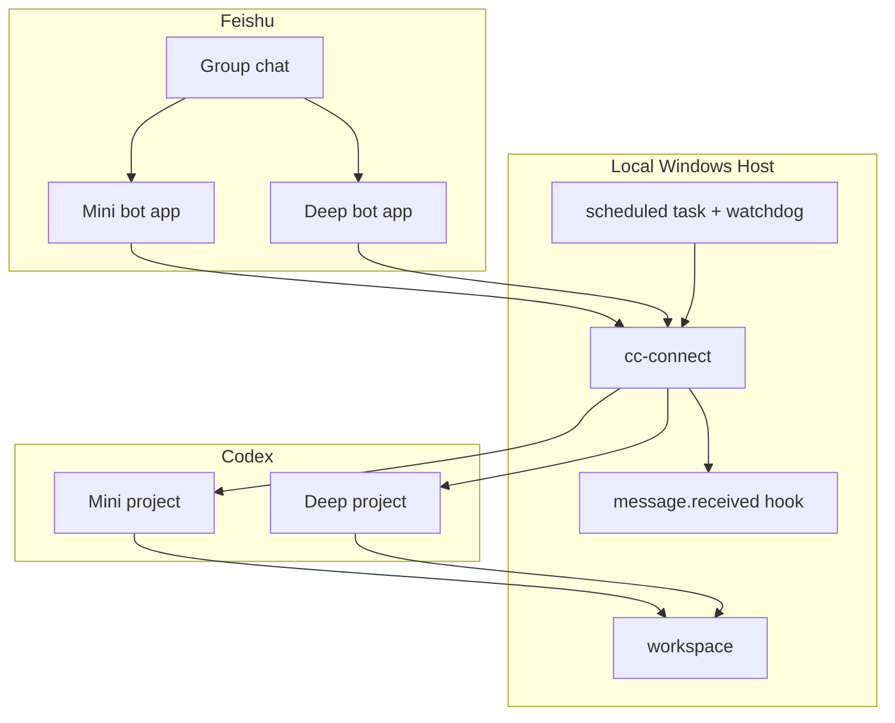

# Architecture

`codex-feishu` uses two Feishu apps because a single bot cannot reliably be both
an all-message monitor and a clean @-only deep worker.

## Components



## Routing

Mini project:

- Feishu app has group all-message permission.
- cc-connect uses `group_reply_all = true`.
- The model decides whether a reply is useful.
- Files and useful context can be processed without an @ mention.

Deep project:

- Feishu app is invited to the group.
- cc-connect uses `group_reply_all = false`.
- Only @ mentions wake the deep model.
- Complex work stays in the deep bot's own thread/session.

## Session Isolation

Both projects use:

```toml
thread_isolation = true
reply_to_trigger = true
```

This maps Feishu reply chains to separate agent sessions. Two users can ask
different root @ questions at the same time, then continue the correct task by
using Feishu reply under the relevant message.

## Background Execution

The install script registers:

- a hidden runner task that starts `cc-connect`;
- a hidden watchdog task that restarts the runner if `cc-connect.exe` is gone.

The acknowledgement hook uses a VBS wrapper and `wscript.exe` so Windows Terminal
does not open for every incoming message.
